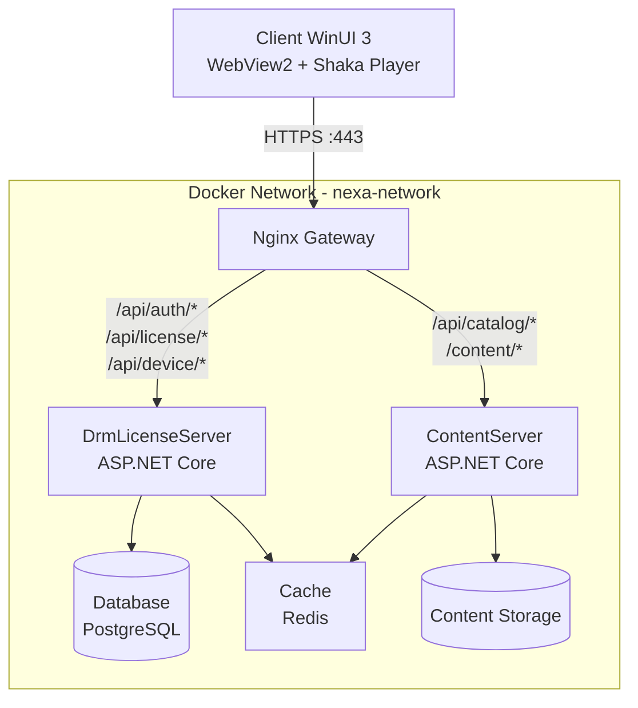
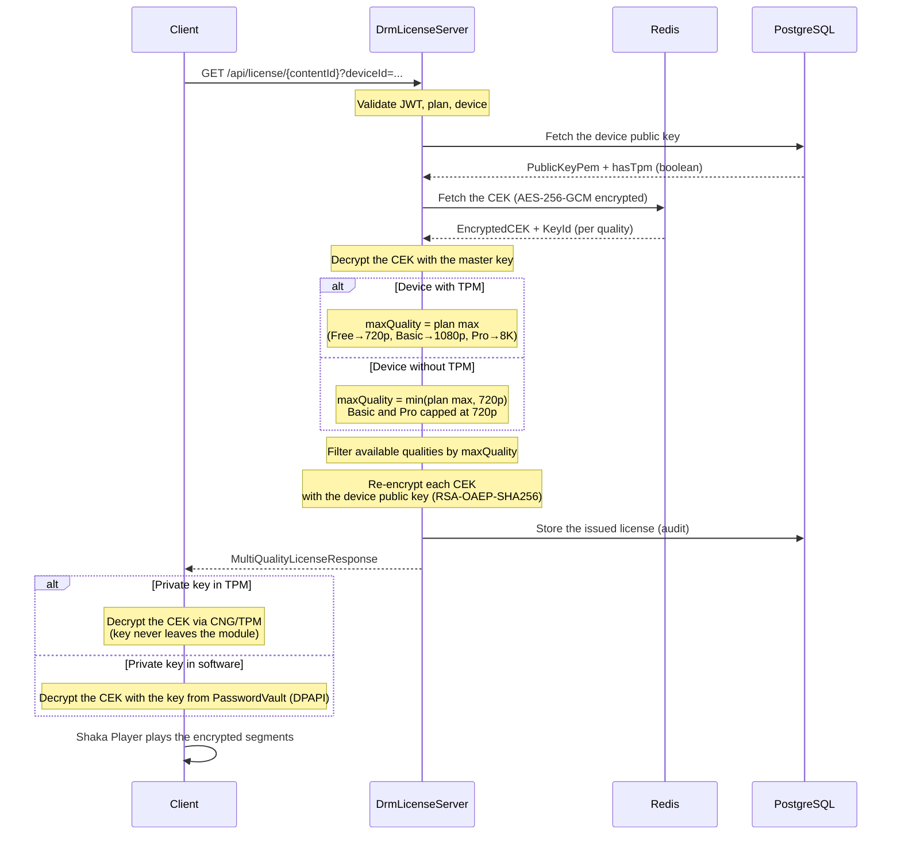
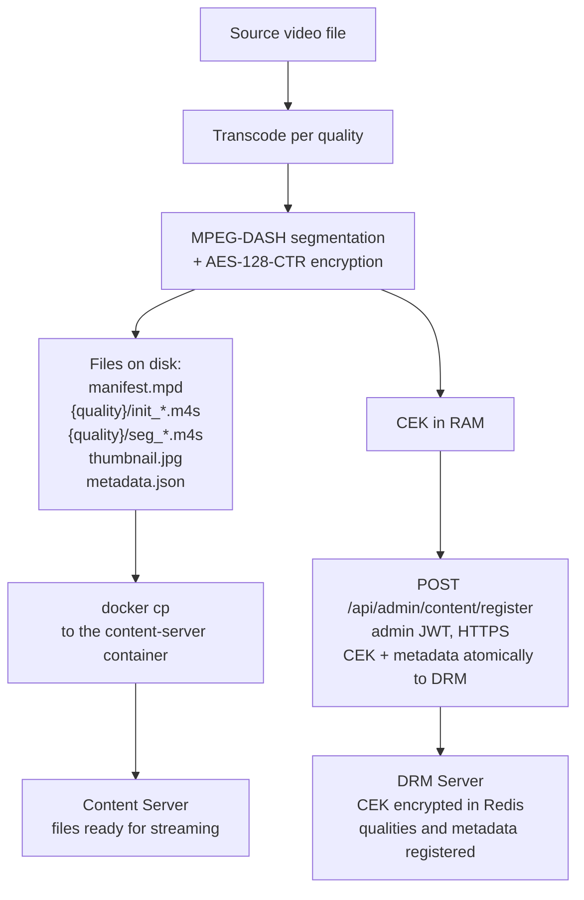

<div align="center">

# NEXA

**Video-on-Demand platform with a custom DRM system**


</div>

---

NEXA is a self-hosted VOD platform with a custom DRM system. It implements the full content-protection lifecycle: from preparing, encrypting and uploading video to the server, through secure distribution of device-bound keys, to enforcing quality and playback limits tied to the subscription plan.

---

## Table of contents

- [Architecture](#architecture)
- [Project structure](#project-structure)
- [DRM system](#drm-system)
- [Content preparation pipeline](#content-preparation-pipeline)
- [Streaming](#streaming)
- [Caching](#caching)
- [API endpoints](#api-endpoints)
- [Client](#client)
- [Screenshots](#screenshots)
- [Quick start](#quick-start)
- [Scripts](#scripts)
- [Requirements](#requirements)

---

## Architecture



Nginx is the single entry point to the system. The backend services do not expose any ports externally; all communication happens over the internal network.

---

## Project structure

```
NEXA/
├── src/
│   ├── DrmLicenseServer/    Authentication, JWT, DRM, licenses, device management
│   ├── ContentServer/       Content catalog, MPEG-DASH streaming
│   ├── Nexa.Client/         WinUI 3 desktop app with the player
│   ├── Shared/              Shared models, exceptions, constants
│   └── TestWebPlayer/       Local HTTP server for playback testing
├── scripts/                 Operational scripts
├── tools/                   CLI tools
├── ssl/                     Sample SSL certificate
├── tests/
├── upload-content.ps1       Full content-import pipeline
├── docker-compose.yml
└── nginx.conf
```

---

## DRM system

### Device key generation

The client uses a TPM-first strategy with automatic software fallback:

| Method | Private key storage | Limitations |
|--------|----------------------------------|--------------|
| **TPM** (Windows CNG) | Hardware module, the key never leaves the TPM | None, so the maximum quality depends on the plan |
| **Software** (RSA-2048) | Windows PasswordVault, DPAPI encryption | Maximum quality capped at 720p |

The device identifier is generated deterministically: `SHA256(public_key)` -> GUID. The same key pair always yields the same Device ID.

### Device registration

The client sends its public key in PEM format together with TPM attestation information. The server validates the PEM format (minimum RSA size is 2048 bits) and the key modulus. Up to 10 devices per user. Changing the key for an existing device is recorded in the audit log.

### License issuance



The CEK stored in Redis is protected by an AES-256-GCM master key. When a license is issued, the CEK is decrypted and then re-encrypted with the public key of the specific device. The private key never leaves the client.

### Quality limits

The maximum available quality depends on the subscription plan and the presence of a TPM:

| Plan | With TPM | Without TPM |
|------|-------|---------|
| Free | 720p | 720p |
| Basic | 1080p | 720p |
| Pro | 4320p | 720p |

The lack of a TPM caps quality at 720p only when the plan allows higher resolutions.

Each quality has its own CEK. This makes it possible to selectively revoke access to higher resolutions without affecting the lower ones.

### License lifecycle

- License validity: 8 hours from issuance
- Heartbeat every 30 seconds; no heartbeat for 2 minutes triggers automatic expiry
- Concurrent stream limits: Free/Basic 1, Pro 2
- `LicenseCleanupService` periodically removes expired records (interval: 6 hours, retention: 7 days)

---

## Content preparation pipeline

The main entry point is `upload-content.ps1`, which orchestrates the whole process from a raw video file to streaming-ready content. The `prepare-content.ps1` script can also be run standalone if the content is to be imported into the server manually.



**Key security.** Each quality gets its own CEK generated in memory (`[System.Security.Cryptography.RandomNumberGenerator]`). Keys are never written to local disk. They are sent only over HTTPS to the admin API and only then encrypted with the AES-256-GCM master key before being stored in Redis.

**Server-side registration.** In a single atomic operation, the `POST /api/admin/content/register` endpoint fetches metadata from ContentServer (`RequiredPlan`, `ReleaseDate`), imports each CEK into Redis, adds the qualities to the qualities set, and invalidates the relevant cache.

### Quality presets

| Quality | Resolution | Video bitrate | Audio bitrate | H.264 profile |
|--------|---------------|---------------|---------------|---------------|
| 144p | 256x144 | 200 kbps | 64 kbps | baseline |
| 240p | 426x240 | 400 kbps | 96 kbps | baseline |
| 360p | 640x360 | 750 kbps | 128 kbps | baseline |
| 480p | 854x480 | 1 Mbps | 128 kbps | baseline |
| 720p | 1280x720 | 3 Mbps | 192 kbps | main |
| 1080p | 1920x1080 | 5 Mbps | 256 kbps | high |
| 1440p | 2560x1440 | 10 Mbps | 320 kbps | high |
| 2160p | 3840x2160 | 20 Mbps | 320 kbps | high |
| 4320p | 7680x4320 | 50 Mbps | 320 kbps | high |

### GPU acceleration

| Accelerator | FFmpeg codec |
|-------------|--------------|
| NVIDIA NVENC | h264_nvenc |
| AMD AMF | h264_amf |
| Intel QSV | h264_qsv |
| CPU | libx264 |

4-second segments with GOP alignment. Each quality is encrypted with a separate CEK.

---

## Streaming

Content is delivered in MPEG-DASH. Codecs: H.264 (video), AAC (audio). HTTP Range request support enables seeking without downloading the entire file. Nginx runs with `proxy_buffering off` and a 300-second timeout for video segments. Initialization segments (`init_*.m4s`) are cached for 24 hours.

---

## Caching

ContentServer uses a two-level cache. L1 is an ASP.NET Output Cache held in RAM. L2 is Redis with a 3600 s TTL. Video segments are not cached server-side but served directly from disk; their caching is left to the HTTP client (e.g. initialization segments `init_*.m4s` receive a `Cache-Control: public, max-age=86400, immutable` header).

**L1: Output Cache (RAM)**

| Endpoint | TTL |
|----------|-----|
| `GET /api/catalog` | 5 min |
| `GET /api/catalog/{id}` | 5 min |
| `GET /content/{id}/manifest.mpd` | 5 min |
| `GET /api/catalog/{id}/thumbnail.jpg` | 1 h |

**L2: Redis**

| Key | Type | TTL | Contents |
|-------|-----|-----|-----------|
| `cek:{contentId}:{quality}` | STRING | none | CEK encrypted with the AES-256-GCM master key |
| `content:meta:{contentId}` | STRING | none | `RequiredPlan`, `ReleaseDate` |
| `content:qualities:{contentId}` | SET | none | Set of available qualities |
| `content:qualities:{contentId}:{plan}:{tpm\|notpm}` | STRING | 3600 s | Sorted list of qualities for the given plan/TPM combination |
| `catalog:ids` | STRING | 3600 s | List of all `contentId` |
| `catalog:id:{contentId}` | STRING | 3600 s | Full metadata |

**Invalidation.** A `FileSystemWatcher` monitors the `/content/storage` directory. Changing `metadata.json` or adding/removing a content folder invalidates the `catalog:ids` and `catalog:id:*` keys in Redis and the `catalog` tag in L1. Importing a CEK via the API invalidates only the `content:qualities:{contentId}:*` keys without touching the CEKs or metadata themselves.

---

## API endpoints

### DrmLicenseServer

| Method | Path | Description | Auth |
|--------|---------|------|-------------|
| POST | `/api/auth/register` | Register a user | None |
| POST | `/api/auth/login` | Log in | None |
| POST | `/api/auth/refresh` | Refresh the token | None |
| POST | `/api/device/register` | Register a device | JWT |
| GET | `/api/device` | List the user's devices | JWT |
| GET | `/api/device/challenge` | Get a device challenge | JWT |
| DELETE | `/api/device/{deviceId}` | Deactivate a device | JWT |
| GET | `/api/license/{contentId}` | Get a DRM license | JWT |
| POST | `/api/license/{contentId}/heartbeat` | Heartbeat for an active stream | JWT |
| DELETE | `/api/license/{contentId}` | Release a license | JWT |
| POST | `/api/admin/content/register` | Atomic content registration: import CEK + metadata from ContentServer in one operation | JWT (`admin` role) |

### ContentServer

| Method | Path | Description | Cache |
|--------|---------|------|-------|
| GET | `/api/catalog` | Content list with pagination and search | 5 min |
| GET | `/api/catalog/{id}` | Content details | 5 min |
| GET | `/content/{id}/manifest.mpd` | MPEG-DASH manifest | 5 min |
| GET | `/content/{id}/{quality}/{segment}` | Video/audio segment | 24 h HTTP Cache (init) |
| GET | `/api/catalog/{id}/thumbnail.jpg` | Thumbnail | 1 h |

---

## Client

A WinUI 3 desktop app with the Shaka Player 4.16 embedded in WebView2. It follows the MVVM pattern with CommunityToolkit.Mvvm. Views are bound to view models, functionality is split into services behind interfaces, and everything is wired through dependency injection.

| Component | Responsibility |
|-----------|-----------------|
| `DeviceRegistrationService` | RSA key generation (TPM/software), device registration |
| `DrmService` | License retrieval, CEK decryption, heartbeat |
| `TokenManager` | Token storage (DPAPI), automatic refresh |
| `CatalogService` | Catalog browsing, search, pagination |
| `SystemHealthService` | Monitoring backend service availability |

The access token is kept in RAM (plaintext), while the refresh token is protected by DPAPI in RAM (single session) or stored securely in the Windows PasswordVault ("Remember me" mode).

---

## Screenshots

| Login | Catalog | Player |
|:---------:|:-------:|:----------:|
|  |  |  |

---

## Quick start

1. Clone the repository
   ```bash
   git clone <repo-url> && cd NEXA
   ```

2. Configure the environment variables
   ```bash
   cp .env.example .env
   # Fill in: JWT_SECRET, MASTER_ENCRYPTION_KEY, POSTGRES_PASSWORD, REDIS_PASSWORD
   ```

3. Install the SSL certificate on Windows. The `ssl/` folder contains a sample SSL certificate; install and trust it in the system, otherwise the player and browsers will reject the secure connection.

4. Start the infrastructure (requires Docker installed)
   ```bash
   docker compose up -d
   ```

5. Add video content (transcoding + upload + CEK registration in one step)
   ```powershell
   ./upload-content.ps1 -InputFile "movie.mp4" -Qualities @('720p','1080p') -Title "Title" -Plan "basic"
   ```

6. Swagger UI is available at:
   `https://localhost/swagger/` for the DRM server
   `https://localhost/content-swagger/` for the Content server

7. Run the desktop client
   Open the `Nexa.sln` solution in Visual Studio (requires the Windows App SDK / WinUI 3 installed).
   Set the `Nexa.Client` project as the startup project and press `F5` to build and run the player.

---

## Scripts

| Script | Description |
|--------|------|
| `upload-content.ps1` | Main pipeline: generates an admin JWT, calls `prepare-content.ps1`, copies the files to the container via `docker cp`, registers the content and imports the CEKs into DRM through `POST /api/admin/content/register`. Keys never touch the disk. |
| `scripts/prepare-content.ps1` | Transcoding (FFmpeg, GPU/CPU), segmentation and encryption (Shaka Packager, AES-128-CTR per quality), thumbnail and `metadata.json` generation. Returns `ContentId` and `EncryptionData` in memory. |
| `scripts/import-ceks.ps1` | Alternative import path: reads `encryption.json` from disk and loads the CEKs into Redis directly. Used when `upload-content.ps1` is not an option (e.g. content prepared manually). |

---

## Requirements

| Component | Version |
|-----------|--------|
| .NET SDK | 9.0+ |
| Docker / Docker Compose | 24+ / 2.20+ |
| PowerShell | 7.0+ |
| FFmpeg | 4.4+ |
| Shaka Packager | 2.6+ |
| Windows SDK | 10.0+ |
